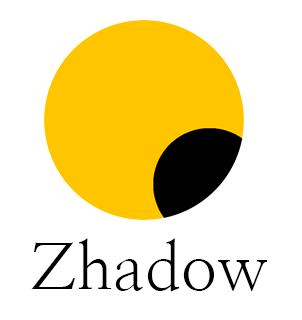

# Chadow - The Flexible integration framework with CraftBukkit
 
Chadow is an engine source based on automation that allows you to design more flexible frameworks when designing Minecraft plugins. All plugins built and designed by the ShadowCreative Team are based on this framework.

